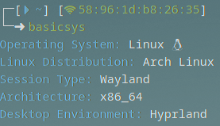

# basicsys
basic bash script to get basic system info (linux only, will error out on other OSes)  

## preview:

  
## requirements:  
- bash
- thats about it

## installation:
`git clone https://github.com/memyboi/basicsys && bash ./basicsys/installation.sh`  
(installation.sh is found in this repo, read through it if you don't find this command trustworthy)
